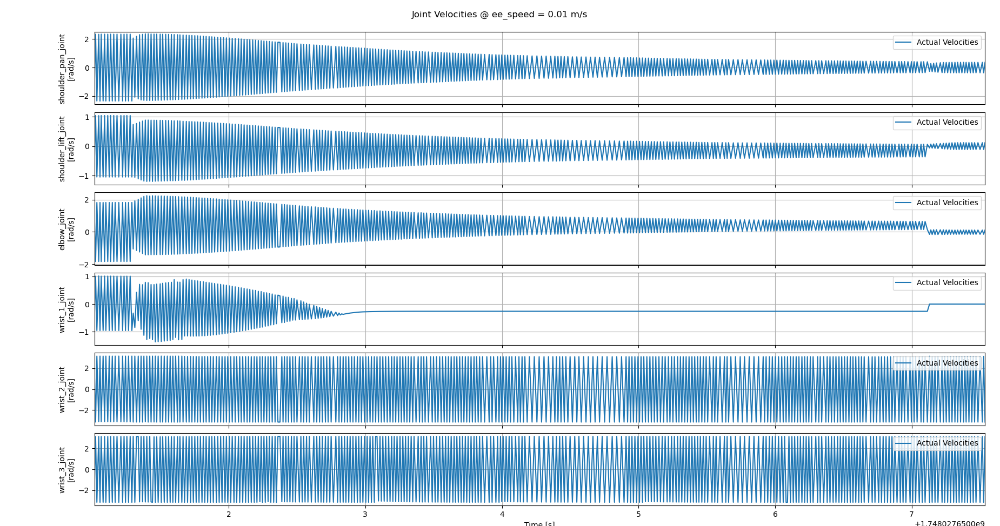
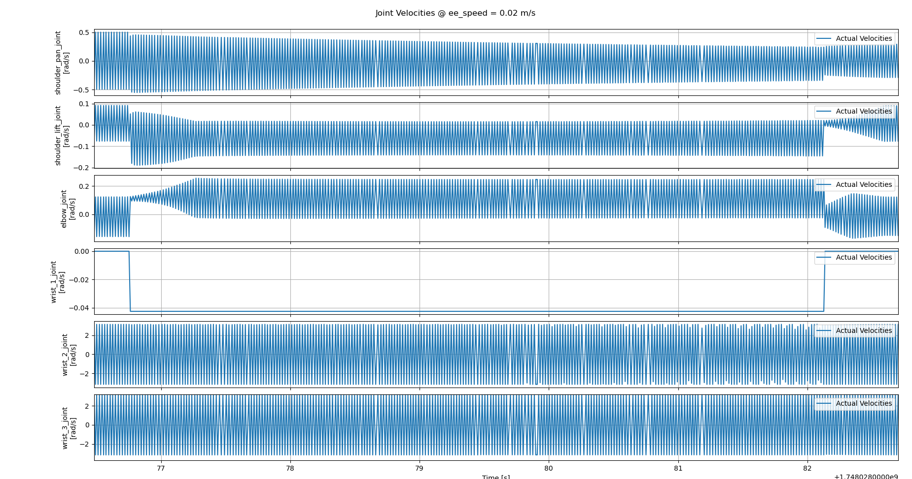
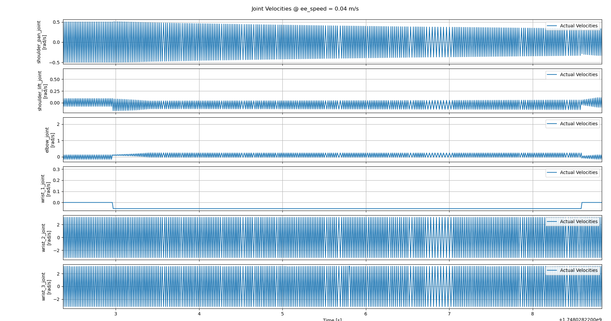

# Cartesian Motion for Robotic Arm

> Coding Assignment for [10xConstruction] Hiring Test

---

## State of Submission

The submission is not complete by any means. I tried my best to achieve a completed status on the project. There were several issues that I faced during the development and am still facing with achieving the desired results.

---

## Approach

> Link to the [assignment PDF]("./'Cartesian Motion Robotic Arm.pdf'").

The assignment mentioned 2 main task and 2 bonus tasks, as mentioned in the PDF:
1. Setup UR10 (or any other 6 DOF) robotic arm in simulation control with Ignition Gazebo.
2. Implement trapezoidal velocity trajectory of end-effector for two waypoints and plot graphs with different speeds of end-effector.
3. Create merging trajectories if more than two trajectories are given. [BONUS]
4. Implement compliance control to apply constant force on the wall, given on direct torque control of joints. [BONUS]

### Task 1 [Setting up the simulation]
- I chose UR10 for this task. All its packgaes were simply available by installing the following apt packages.
```bash
ros-humble-ur-simulation-gz
ros-humbler-ur-description
```
- The launch file `ur_sim_control.launch.py` came with a UR10 simulation integrated with ros2 control controllers to execute trajectories in joint space.

### Task 2 [Implementing Trapezoidal Velocity Trajectory of End Effector]
Initially I thought this could be solved with MoveIt Cartesian planner. However, I realised that MoveIt2 will not provide any control over the trajectory to plan a trapezoidal tool trajectory. My approach could be broken down to following steps:
1. Create a trapezoidal trajectory between two points in a plane in dextrous region of the robot. 
  - Used KDL lib's trajectory generation headers which readily provided implementations of various trajectory splines and lines along with trapezoidal profile. 
  - Initially, unaware of this functionality of KDL, also tried to implement the trapezoidal trajectory on my own -can be seen in  first commit's trajectory_generator.cpp.
2. Convert the trajectory thus generated from X-space to C-space using inverse kinematics modules.
  - Tried KDL and TracIK implementations for this approach.
  - Initially implemented KDL only and expected it to work, only to see it fail painfully.
  - Later, cloned trac_ik from git bucket and built from source since no apt installation packages were available. (Can be seen in .gitsubmodules file.)
  - Convert not only the X-space positions but also X-space velocities to ensure smooth and precise motion in single plane.
3. Implement an action server to accept waypoint goals in single plane and publish trajectory to the robot controller.
4. Configure the ros2 controllers to accept trajectories and execute them smoothly.
  - Created a custom [ur_controllers.yaml](./cartesian_motion_control/config/ur_controllers.yaml) for this task.
  - Went through the [ros2 control documentation](https://control.ros.org/rolling/index.html) and identified that the controller I need to use (joint_trajectory_controller).
  - Went through [the parameter documentation for joint_trajectory_controller](https://github.com/ros-controls/ros2_controllers/blob/master/joint_trajectory_controller/src/joint_trajectory_controller_parameters.yaml) and identified the parameters meanings are modifiable and which need to be changed.
  - Decided to setup joint_trajectory_controller with velocity command interface to ensure smooth motion.
  - Created [python script](./cartesian_motion_tests/cartesian_motion_tests/controller_tune.py) using ChatGPT to send sinusoidal velocity commands to individual joints and tuned the velocity controller considering the responses.

NOTE: A lot of time was spent just on debugging the issues with KDL and TracIK libs since it was my first time on working with them. As a result, I was not able to attempt Tasks 3 and 4.

---

## Project Setup
1. Clone this repository in the src folder of a colcon workspace using the submodules command (to clone trac-ik package too).
`git clone --recurse-submodules git@github.com:videh25/CartesianMotionsForManipulator.git`
2. Colcon build the workspace.
2. Install the KDL Library. `sudo apt install liborocos-kdl-dev`.
3. Install the above mentioned UR10 apt packages.

---
## Project Structure

```bash
.
├── cartesian_motion_control           # Package containing the main C++ nodes for trajectory generation and action server implementation.
    ├── config
    │   ├── params.yaml                # Parameters for the trajectory generation
    │   ├── sample_path_points.yaml    # Personal reference file to store some valid points for trajectories
    │   └── ur_controllers.yaml        # Custom controllers config to allow desired behavior
    ├── include
    │   └── cartesian_motion_control
    │       ├── cartesian_motion_server.hpp # Action Server header
    │       ├── ik_solver_handlers.hpp      # KDL and TracIK solver adapter for code
    │       └── trajectory_generator.hpp    # Trajectory generator header
    ├── src
    │   ├── cartesian_motion_server.cpp
    │   ├── main.cpp                        # Action server node
    │   └── trajectory_generator.cpp
    └── urdf
        └── ur10.urdf                   # UR10 urdf to be referenced by IK solvers in the code
├── cartesian_motion_interfaces         # Package containing the custom action interface
├── cartesian_motion_tests              # Various python scripts useful for this project
    ├── cartesian_motion_tests
    │   ├── __init__.py
    │   ├── controller_tune.py          # Script to assist while tune PID controllers (Specify joint name, initial joint position and run the script to publish sinusoidal velocity commands for a joint and plot the motor response)
    │   ├── motion_plotter.py           # Script to plot the record end effector path and record joint positions and plot them
    │   └── send_cartesian_goal.py      # Script to call the cartesian action server
└── trac_ik                             # trac-ik library
```

---

## Plots for different End Effector speeds
1. Tool Speed = 0.01 m/s




2. Tool Speed = 0.02 m/s




3. Tool Speed = 0.04 m/s




## Execution Media
